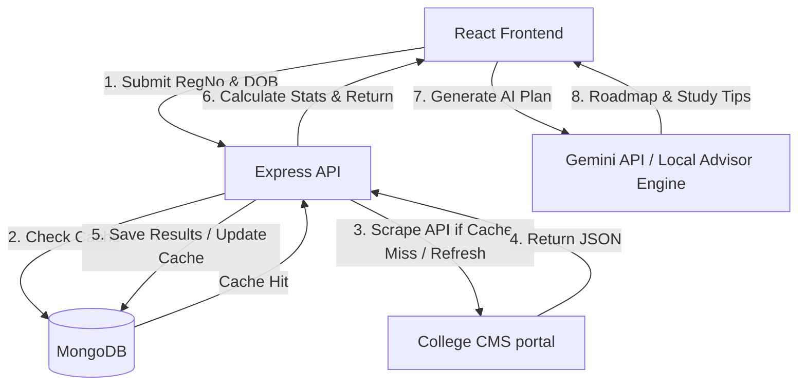

# 📊 GTNAC CGPA Calculator & AI Target Optimizer

A premium academic performance tracker, predictive goal optimizer, and result scraping dashboard designed for GTNAC. It features a modern dark glassmorphic interface, automatic grade/credit calculation, A4 printable reports, and an AI-driven academic advisor.

---

## 🏗️ System Architecture



---

## ✨ Features

- **Automatic Scraping & Syncing:** Connects securely to the college portal API using the student's Register Number and Date of Birth to fetch official marks.
- **Fast Cached Loading:** Automatically stores scraped marks in a MongoDB database. Subsequent requests load instantly, with a background sync checking for updates.
- **Interactive Dashboard:** Beautiful dark dark-mode dashboard showcasing:
  - Overall CGPA (10.0 scale)
  - Semester-wise SGPA
  - Semester detailed results via elegant modal popups
  - Average marks, highest/lowest grades, and active backlog count
- **AI Goal Advisor & Target Optimizer:**
  - Enter your target CGPA and course duration.
  - Dynamically calculates the required SGPA to reach your goal.
  - Provides a structured semester roadmap, subject-specific improvements (leveraging Gemini 2.5 Flash), and productivity tips.
- **Manual Marks Manager:** Simulate mock semesters, grades, and credits to forecast GPA changes.
- **Official Print View:** Clean A4 print layout optimized for PDF generation.

---

## 📂 Project Structure

```
cgpa-calculator/
├── client/                 # React frontend (Vite + Tailwind + Framer Motion)
│   ├── src/
│   │   ├── components/     # Reusable UI parts (AiGoalAdvisor, ManualMarksManager, etc.)
│   │   ├── App.jsx         # Main state manager & fetch logic
│   │   ├── index.css       # Design variables, typography & layout styles
│   │   └── main.jsx
│   └── package.json
└── backend/                # Node.js + Express backend server
    ├── models/             # Mongoose schemas (Result)
    ├── routes/             # API routes (result, image proxies, AI analyzer)
    ├── services/           # External portal scraping logic
    ├── utils/              # Math utilities for grade points & CGPA
    ├── server.js           # Server initialization & middleware setup
    └── package.json
```

---

## 🚀 Setup & Installation

### Prerequisites

- Node.js (v20.x or above)
- MongoDB database (local installation or MongoDB Atlas cluster)

### 1. Configure the Backend

1. Navigate to the backend directory:
   ```bash
   cd backend
   ```
2. Install dependencies:
   ```bash
   npm install
   ```
3. Create a `.env` file in the `backend/` directory:
   ```env
   PORT=5000
   MONGO_URI=mongodb://localhost:27017/cgpa-calculator
   GEMINI_API_KEY=your_gemini_api_key_here
   BASE_URL=http://localhost:5000
   ```
4. Start the server:
   ```bash
   npm start
   # Or for development with automatic reloading:
   npm run dev
   ```

### 2. Configure the Frontend

1. Open a new terminal and navigate to the client directory:
   ```bash
   cd client
   ```
2. Install dependencies:
   ```bash
   npm install
   ```
3. Start the Vite dev server:
   ```bash
   npm run dev
   ```
4. Open your browser and navigate to `http://localhost:5173`.

---

## ⚙️ Technical Details

### CGPA Calculation Method

The calculator maps academic grades to point thresholds according to the university standard:

- **O+ / O:** `10.0`
- **D++ / D+ / D:** `9.0` to `7.5`
- **A++ / A+ / A:** `7.0` to `6.0`
- **B+ / B:** `5.5` to `5.0`
- **C+ / C:** `4.5` to `4.0`
- **U (Re-appear):** `0.0`

The system calculates:
$$\text{CGPA} = \frac{\sum (\text{Subject Grade Point} \times \text{Credits})}{\sum \text{Total Credits}}$$

### Target Feasibility Logic

The AI Target Advisor determines the average SGPA required for the remaining semesters using:
$$\text{Required SGPA} = \frac{(\text{Target CGPA} \times \text{Total Semesters}) - (\text{Current CGPA} \times \text{Completed Semesters})}{\text{Total Semesters} - \text{Completed Semesters}}$$

- If the required SGPA exceeds `10.0`, the system automatically marks it as **Impossible** and outlines the maximum achievable CGPA instead.
- Otherwise, it categorizes it as **Challenging**, **Moderate**, or **Safe** and requests an optimized roadmap from Gemini.

---

## 🔒 Security & Privacy

No sensitive credentials or student passwords are saved. The application only requires the Register Number and Date of Birth to interface with the college portal API. The MongoDB cache acts as a fast-read cache and does not collect password data.

## 👨‍💻 Author

Ranjith Babu S (Web Developer)
Portfolio link - https://ranjithbabu.vercel.app/
